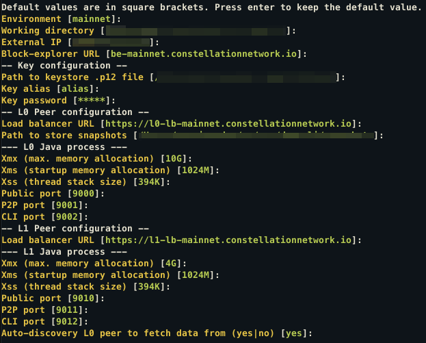
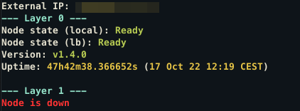

DAG Command Line Utility
---

---

```
DAG Command Line Utility

Usage:
  dag [flags]
  dag [command]

Available Commands:
  completion  Generate the autocompletion script for the specified shell
  configure   Configure your node
  help        Help about any command
  join        Join layer to the network
  leave       Leave layer from the network
  start       Start layer process
  stop        Stop layer process
  upgrade     Upgrade Tessellation version

Flags:
  -h, --help      help for dag
      --verbose   verbose output
  -v, --version   version for dag

Use "dag [command] --help" for more information about a command.
```

## Configure your node

```shell
$ dag configure
```


## Upgrade Tessellation version

```shell
$ dag upgrade latest

$ dag upgrade v1.4.0
```

Enter version you want to upgrade to, or `latest` to fetch the latest version from the network.

## Start L0 and L1 layers and join the network
```shell
$ dag start l0
$ dag join l0

$ dag start l1
$ dag join l1
```

## Show your node status
```shell
$ dag
```


## Leave the network and stop L0 and L1 layers
```shell
$ dag leave l0
$ dag stop l0

$ dag leave l1
$ dag stop l1
```